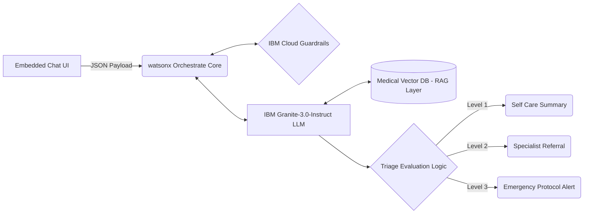

# VitalCheck AI: Health Symptom Checker Agent 🩺

VitalCheck AI is an enterprise-grade, multi-agent medical triage assistant built using **Langflow**, **IBM watsonx.ai**, and **IBM Granite Models**. The system acts as an interactive healthcare navigator, converting unstructured user symptom descriptions into a rigorous, clinical-grade triage evaluation without throwing unsafe medical diagnoses.

---

## 🚀 Key Features

* **Autonomous Triage Logic:** Dynamically classifies severity into three strict, color-coded response vectors: *Self Care (Green)*, *Urgent Care (Yellow)*, and *Emergency (Red)*.
* **Medical Knowledge RAG:** Uses a Retrieval-Augmented Generation pipeline backed by an indexed vector database to feed validated clinical insights directly to the LLM context layer.
* **IBM Cloud Guardrails:** Automated validation loops filter non-medical chatter and enforce structured medical liability disclaimers.
* **Specialist Mapping Engine:** Evaluates systemic symptom patterns to intelligently route users to the appropriate medical field (e.g., *Cardiology, Neurology, ENT*).

---

## 🏗️ Architecture Blueprint

The system splits production logic into isolated abstraction zones to manage security boundaries seamlessly:



---

## 🛠️ Tech Stack & Infrastructure

* **Orchestration Engine:** Langflow (v1.9.6+)
* **Core Language Model:** `ibm-granite-3-2-8b-instruct` / `Granite-3.0-8B-Instruct`
* **RAG Infrastructure:** LangChain Vector Store (FAISS / Chroma DB embeddings)
* **Cloud Platform:** IBM watsonx.ai running securely on IBM Cloud Lite runtime layers


## 📁 Repository Structure

```text
├── app.json                           # Completed Langflow visual workflow schematic export
├── HealthSymptomChecker_Statement.pdf # Official project evaluation scope specification
├── HealthSymptomChecker_Pres.pptx     # Core presentation deck mapped directly to the template
└── README.md                          # Detailed installation and architecture specification

```

---

## 🔮 Future Enhancement Vectors

* **Biometric Synchronization:** Integration points with Apple HealthKit or Fitbit device endpoints to analyze concurrent metrics (Heart Rate, $SpO_2$) along with text symptom profiles.
* **Telehealth Hand-off API:** One-click integration mapping directly into real-time scheduling APIs for live clinic appointments or localized emergency response coordination.

---


***Disclaimer:** VitalCheck AI is an educational concept prototype leveraging IBM watsonx systems architecture. It provides high-probability triage indicators for information purposes only and does not substitute for qualified expert clinical evaluations.*
